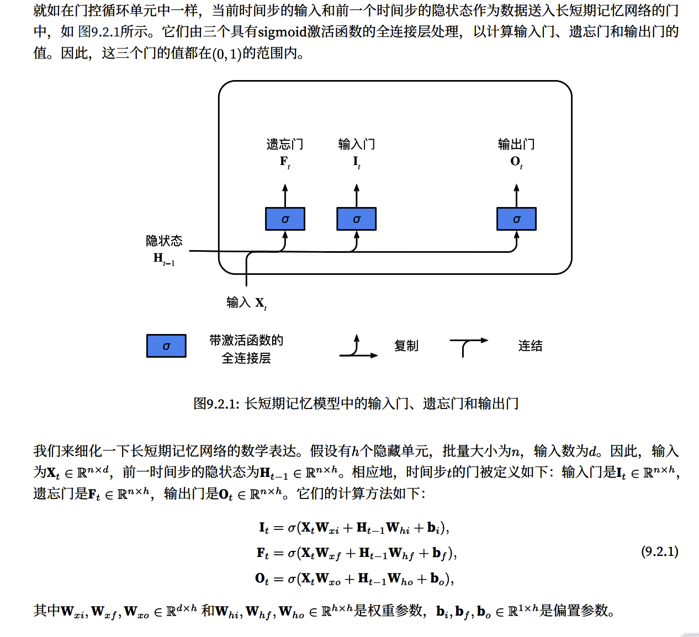
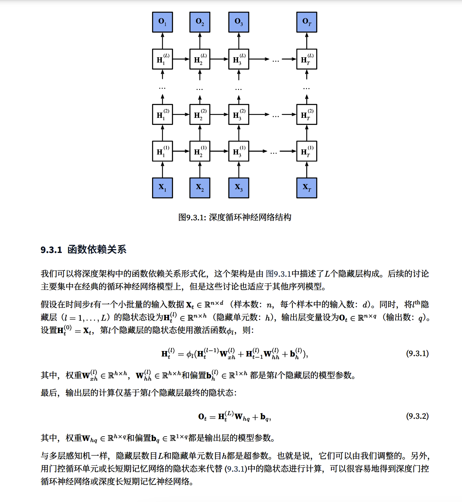

# 现代循环神经网络
循环神经⽹络在实践中⼀个常⻅问题是数值不稳定性。尽管我们已经应⽤了梯度裁剪等技巧来缓解这
个问题，但是仍需要通过设计更复杂的序列模型来进⼀步处理它。具体来说，我们将引⼊两个⼴泛使⽤的⽹
络，即⻔控循环单元（gated recurrent units，GRU）和 ⻓短期记忆⽹络（long short-term memory，LSTM）。

## 门控循环单元

### 门控隐状态
门控循环单元和普通的循环神经网络之间的关键区别在于：<u>前者支持隐状态的门控，这意味着模型有专门的机制来确定应该何时更新隐状态，以及何时重置隐状态。</u>

**重置门和更新门**
重置门(reset gate)
更新门(update gate)

**候选隐状态**
**隐状态**

门控循环单位具有以下两个显著特征
- 重置门有助于捕获序列中的短期依赖关系
- 更新门有助于捕获序列中的长期依赖关系
  
### 实现代码
> GRU_1.py 

#### 初始化模型参数

从标准差为0.01的高斯分布中提取权重，并将偏置项设为0，超参数num_hiddens定义隐藏单元的数量，实例化与更新门，重置门，候选隐藏状态和输出层相关权重和偏置

## 长短期记忆网络

### 门控记忆元

⻓短期记忆⽹络引⼊了记忆元（memory cell）， 或简称为单元（cell）。有些⽂献认为记忆元是隐状态的⼀种特殊类型，它们与隐状态具有相同的形状，其设 计⽬的是⽤于记录附加的信息。为了控制记忆元，我们需要许多⻔。其中⼀个⻔⽤来从单元中输出条⽬，我 们将其称为输出⻔（output gate）。另外⼀个⻔⽤来决定何时将数据读⼊单元，我们将其称为输⼊⻔（input gate）。我们还需要⼀种机制来重置单元的内容，由遗忘⻔（forget gate）来管理，这种设计的动机与⻔控循 环单元相同，能够通过专⽤机制决定什么时候记忆或忽略隐状态中的输⼊。

#### 输入门，忘记门和输出门

#### 候选记忆元 

使用`tanh`作为激活函数，函数范围为(-1,1)

#### 记忆元

在GRU中，有一种机制来控制输入和遗忘。类似的，在长短期记忆网络中，也有两个门用于这样的目的。

引入这种设计为缓解梯度消失问题，并更好地捕获序列中的长距离依赖关系。

#### 隐状态

### 实现代码

> GRU_2.py

#### 初始化模型参数

num_hiddens定义隐藏单元的数量，按照标准差0.01的高斯分布初始化权重，并将偏置项设为0

## 深度循环神经网络

GRU和LSTM都是单向隐藏层的循环神经网络。

那么如何在循环神经网络中添加更加多的层，以及在哪里添加额外的非线性？

可以将多层循环神经网络堆叠在一起，通过几个层的组合，产生一个灵活的机制，特别是，数据可能与不同层的堆叠有关。

### 函数依赖关系

### 简洁实现

> GRU_3.py

## 双向循环神经网络

> 多用于自然语言中的填空题类似

### 隐马尔可夫模型中的动态规划

math goodbye 

### 双向模型 

如果我们希望在循环神经⽹络中拥有⼀种机制，使之能够提供与隐⻢尔可夫模型类似的前瞻能⼒，我们就需 要修改循环神经⽹络的设计。幸运的是<u>，这在概念上很容易，只需要增加⼀个“从最后⼀个词元开始从后向 前运⾏”的循环神经⽹络，⽽不是只有⼀个在前向模式下“从第⼀个词元开始运⾏”的循环神经⽹络。</u>

**双向循环神经网络（bidirectionals RNNs)**添加了反向传递信息的隐藏层。以便更灵活地处理此类信息。

### 双向循环神经网络的错误应用

## 机器翻译与数据集

## 编码器-解码器架构

## 序列到序列学习

## 束搜索
